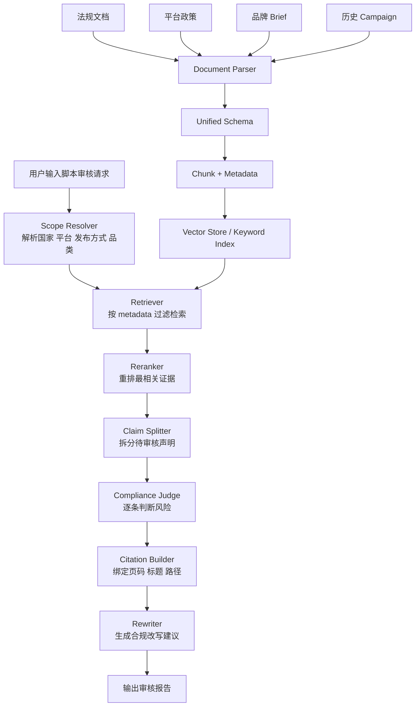

# 发布约束 Agent 技术路线完整文档

## 1. 这份文档是干什么的

这份文档用最容易理解的方式，说明如何在当前项目中开发一个新的 `舆论控制 Agent`。

这个 Agent 的目标不是“写文案”，而是“在文案交给 KOL 之前，先做合规和品牌调性检查”。

它要完成的核心任务有 4 个：

1. 读取复杂静态文档。
2. 把文档整理成适合 RAG 检索的知识库。
3. 在审核营销文案时，只检索目标国家/地区和目标平台相关的信息。
4. 输出带可验证引文的合规报告，告诉我们哪里有风险、为什么有风险、应该怎么改。

这份文档默认读者是小白，所以会先讲概念，再讲方案，再讲怎么一步一步做出来。

---

## 2. 一句话理解这个 Agent

可以把这个 Agent 理解成一个“营销内容审核员”。

当用户输入一条营销短视频脚本或图文文案时，它不会立刻说“能发”或“不能发”，而是会先去查：

- 目标国家的法律
- 目标平台的规则
- 品牌内部的历史 Campaign Brief
- 该品牌自己的表达禁区和风格要求

然后它会给出一份审核结果：

- 是否建议发布
- 风险等级
- 哪一句有问题
- 违反了什么规则
- 证据出自哪一份文档、哪一页、哪一节
- 可以怎样改写

这就是一个真正有用的 `Compliance RAG Agent`。

---

## 3. 为什么需要它

你的项目主要面向这些平台：

- YouTube
- Instagram
- TikTok
- X
- Reddit

你的内容主要是：

- 产品营销短视频
- 产品营销图文

你的发布区域又是全球多地区：

- 美洲英语区
- 西语区
- 葡语区
- 欧洲
- 中东

这意味着你面对的不是“一套规则”，而是很多层规则同时存在：

- 当地广告法
- 平台社区规范
- 平台商业化或广告政策
- 品牌自己的语气和禁用表达

如果没有一个专门的 Agent 来做审核，脚本写得再好，也可能出现这些问题：

- 在某个国家触犯广告法
- 在某个平台违反 branded content 或 paid promotion 规则
- 用词不符合品牌调性
- 说法虽然没有违法，但过度夸张，容易被平台限流或投诉

---

## 4. 我们最终要解决的真实问题

这个 Agent 不是做“通用问答”，而是做“强约束的合规检索和审核”。

这句话很重要。

很多人一提到 RAG，就会想到“把文档丢进去，问问题，再让模型回答”。  
但你的项目不能只做到这个程度，因为这里是高风险场景。

你的真实目标是：

`营销文案审核 = 文档解析 + 定向检索 + 逐条校验 + 引文回溯 + 风险分级 + 改写建议`

所以我们最终做的不是一个普通聊天机器人，而是一条完整的审核流水线。

---

## 5. 当前项目现状

当前仓库已经有一套基础的多 Agent 工作流：

- `LangGraph`
- `LangChain`
- `Streamlit`
- `DeepSeek` 兼容 OpenAI 协议调用

目前核心流程大致是：

`Profiler -> TrendHunter -> ScriptWriter`

也就是说，项目已经具备：

- 状态流转
- 多节点工作流
- LLM 调用能力
- 脚本生成能力

但是还没有：

- 合规检索层
- 文档解析流水线
- 向量库
- 引文系统
- 审核报告结构

所以新 Agent 不是推翻重做，而是在现有项目上继续扩展。

---

## 6. 最终推荐的整体路线

### 6.1 一句话版

最终推荐路线是：

`复杂文档解析 -> 统一结构化 -> 按国家/平台打标签 -> 混合检索 -> 重排 -> 逐条合规判断 -> 引文输出 -> 必要时改写`

### 6.2 为什么这样选

这是结合了前面所有讨论后，最适合你项目的一条路线，因为它同时满足：

- 平台多
- 地区多
- 文档复杂
- 需要可验证引文
- 尽量免费
- 适合接入当前 `LangGraph` 项目

---

## 7. 这条路线里，每一层分别在做什么

### 7.1 文档解析层

目标：把复杂 PDF、扫描件、表格、品牌内部 Brief 解析成结构化内容。

推荐栈：

- `PaddleOCR 3.x / PP-StructureV3` 作为主力解析器
- `Unstructured OSS` 作为统一结构层
- `LlamaParse` 只在复杂文档解析失败时作为兜底

为什么这么选：

- `PaddleOCR` 对中文和复杂版面支持好，而且本地可跑，适合免费优先。
- `Unstructured` 很适合把不同来源的解析结果统一成稳定元素。
- `LlamaParse` 很强，但更像高级兜底方案，不适合作为默认主线，因为你希望尽量免费。

### 7.2 统一结构层

目标：把所有解析器的输出统一成同一种格式。

这是整个系统里最容易被忽略，但最关键的一层。

如果不同解析器输出格式不一样，后面的切块、向量化、检索和引文都会乱掉。

建议统一成这样的数据结构：

```json
{
  "doc_id": "law_br_ads_2025_001",
  "source_url": "https://example.com",
  "source_type": "law",
  "platform": null,
  "distribution_mode": null,
  "country_code": "BR",
  "region_pack": "LATAM",
  "language": "pt-BR",
  "effective_from": "2025-01-01",
  "effective_to": null,
  "is_global_fallback": false,
  "page_num": 12,
  "block_id": "p12_b04",
  "block_type": "paragraph",
  "heading_path": ["Capitulo 5", "Artigo 12", "Paragrafo 2"],
  "article_no": "12",
  "clause_no": "2",
  "text": "......",
  "text_as_html": null,
  "bbox": [0, 0, 100, 80],
  "source_hash": "sha256:..."
}
```

这层做得越标准，后面越省事。

### 7.3 切块层

目标：把文档切成适合检索的小块，但不能破坏法律条文和层级关系。

不推荐粗暴按固定字数切块。  
推荐规则是：

- 先按 `标题层级` 切
- 再按 `条文编号` 切
- 表格单独切
- 如果块太大，再按段落做二次切分

切块时一定保留：

- `heading_path`
- `page_num`
- `article_no`
- `clause_no`
- `country_code`
- `platform`
- `distribution_mode`

因为这些字段后面直接决定：

- 检索过滤是否准确
- 引文是否可信
- 报告是否可审计

### 7.4 检索层

目标：从正确的知识库里，把最相关的证据块找出来。

这里不推荐只用“纯向量检索”，因为法律、平台政策、品牌术语里有很多精确关键词。

推荐做法是：

`Hybrid Retrieval = 关键词检索 + 向量检索`

原因：

- 关键词检索擅长命中条款编号、固定术语、禁用词。
- 向量检索擅长理解语义相似表达。
- 两者结合更稳。

对于你的场景，检索必须带硬过滤，而不是只做相似度排序。

例如用户要审的是：

- 平台：Instagram
- 国家：Brazil
- 发布方式：Branded Content
- 产品：护肤品

那么系统只允许优先检索：

- 巴西当地法律
- Instagram 相关政策
- 品牌内部相关 brief

而不是把美国规则、西班牙规则、TikTok 规则混进来。

### 7.5 重排层

目标：把已经召回的结果再按相关性重新排序。

为什么要有这一层：

- 初次检索可能会召回很多“有点像但不够准”的内容。
- 重排模型能把真正最相关的几个证据放到前面。

推荐：

- `BAAI/bge-reranker-v2-m3`

它是多语言模型，适合英语、西语、葡语、阿语混合环境。

### 7.6 判断层

目标：不是简单回答“有没有问题”，而是逐条判断文案中的 claim 是否合规。

这里推荐做“Claim 级校验”。

意思是先把文案拆成若干条声明，再一条条检查，例如：

- 产品效果承诺
- 时间承诺
- 排他性表达
- 对比性表达
- 医疗或功能暗示
- 适龄或敏感人群表达

这样做的好处是：

- 容易找到具体风险点
- 容易生成引用
- 容易给出改写建议

### 7.7 引文层

目标：保证每条结论都能回到源文档，不是“模型自己说了算”。

引文字段建议最少包含：

- `doc_id`
- `source_title`
- `source_url`
- `page_num`
- `heading_path`
- `block_id`
- `quote_text`
- `source_hash`

最终报告里每条风险都应该像这样：

```json
{
  "claim": "本产品7天内可彻底消除细纹",
  "risk_level": "high",
  "reason": "包含明确效果与时间承诺，存在夸大宣传风险",
  "citations": [
    {
      "doc_id": "law_br_ads_2025_001",
      "page_num": 12,
      "heading_path": ["Capitulo 5", "Artigo 12", "Paragrafo 2"],
      "block_id": "p12_b04"
    }
  ]
}
```

### 7.8 改写层

目标：当内容有风险时，不只是“报错”，还要给出更安全的可发布版本。

例如：

- 原句：`7天内彻底祛皱`
- 改写：`持续使用后，有助于改善肌肤细纹观感`

改写时仍然必须参考：

- 当地法律
- 平台规则
- 品牌语气

---

## 8. 为什么不是只选一个解析器就够了

前面讨论过的技术栈：

- Unstructured.io
- LlamaParse
- 阿里或开源版的版面解析路线
- 百度或 PaddleOCR 路线

这里要明确一个认知：

这些工具主要解决的是“文档读得准不准”，而不是“整个 Agent 做得成不成”。

换句话说：

- 它们属于 `文档解析层`
- 不是完整的 `合规 RAG 系统`

所以正确理解应该是：

`解析器是地基，RAG 流程是房子`

如果地基不好，房子盖不稳。  
但只有地基，没有房子，也住不了人。

因此最终方案不是“只选解析器”，而是：

`解析器 + 检索系统 + 引文系统 + 合规判断系统`

---

## 9. 免费优先时，推荐的技术栈

### 9.1 默认主线

- 文档解析：`PaddleOCR 3.x / PP-StructureV3`
- 结构统一：`Unstructured OSS`
- 向量库：`Qdrant Local`
- Embedding：`BAAI/bge-m3`
- Reranker：`BAAI/bge-reranker-v2-m3`
- 编排：`LangGraph`
- LLM：沿用当前项目的 `DeepSeek`

### 9.2 为什么它最适合“尽量免费”

- 本地可跑，不依赖高额 SaaS。
- 多语言支持较好。
- 适合全球多国家、多平台的 metadata 过滤。
- 能兼容你当前已有的 Python 项目。

### 9.3 什么情况下才用 LlamaParse

只在这些情况下启用：

- 扫描质量很差
- 表格结构特别复杂
- 普通 OCR 后条文层级严重错乱
- 某些重要 PDF 必须高质量解析

也就是说：

`LlamaParse 是增强方案，不是默认方案`

这样才能控制成本。

---

## 10. 如何保证“只使用当地信息”

这是整个项目最重要的业务规则之一。

答案不是“靠提示词提醒模型”，而是“在检索层硬限制”。

### 10.1 必须新增的输入字段

当前项目只有：

- `target_platform`
- `target_languages`

这还不够。

必须新增：

- `target_country`
- `target_region_pack`
- `distribution_mode`
- `product_category`
- `brand_id`

#### 字段说明

- `target_country`：最终发布国家，例如 `BR`、`US`、`AE`
- `target_region_pack`：大区标签，例如 `LATAM`、`EU`、`MENA`
- `distribution_mode`：内容类型，例如 `organic`、`branded_content`、`paid_ads`
- `product_category`：产品类别，例如 `beauty`、`supplement`、`electronics`
- `brand_id`：品牌或客户标识

### 10.2 检索优先级

推荐固定成下面这个顺序：

`当地法律 > 当地平台市场页 > 区域规则 > 平台全球规则 > 品牌内部规则`

例如：

- 巴西发布 Instagram 护肤品合作内容

优先级应当是：

1. 巴西当地法律
2. Instagram/Meta 在巴西适用的政策
3. LATAM 或相关区域规则
4. Instagram/Meta 全球规则
5. 品牌内部 brief

### 10.3 没有当地资料时怎么办

不要偷偷用别的国家法律替代。

正确做法是：

- 平台规则可以回退到全球规则
- 法律规则不允许用其他国家规则替代
- 如果缺少当地法律证据，报告中必须明确标注：

`insufficient_local_legal_evidence`

这比“看起来回答了，其实答错了”安全得多。

### 10.4 Reddit 的特殊情况

Reddit 不能只看平台级规则。

因为很多限制发生在：

- subreddit 规则
- 社区自定义发帖规范

所以如果未来要支持 Reddit 的实际发帖审核，除了平台政策以外，最好还支持：

- subreddit 级规则采集
- subreddit 白名单机制

但是要注意数据合规，不要随意把 Reddit 大量用户内容抓下来建知识库。

---

## 11. 推荐的系统架构图



---

## 12. 建议加入当前项目的 Agent 设计

推荐在当前工作流基础上新增 4 个节点：

- `ComplianceScopeResolver`
- `ComplianceRetriever`
- `ComplianceJudge`
- `ComplianceRewriter`

新的流程建议为：

`Profiler -> TrendHunter -> ScriptWriter -> ComplianceScopeResolver -> ComplianceRetriever -> ComplianceJudge -> ComplianceRewriter`

### 12.1 各节点职责

#### `ComplianceScopeResolver`

负责把用户输入转换成严格的审核范围。

输出示例：

```json
{
  "target_country": "BR",
  "target_region_pack": "LATAM",
  "target_platform": "Instagram",
  "distribution_mode": "branded_content",
  "product_category": "beauty"
}
```

#### `ComplianceRetriever`

负责按 metadata 过滤并检索证据。

它不直接下结论，只负责把“可能相关的证据”找出来。

#### `ComplianceJudge`

负责逐条判断风险并产出结构化报告。

#### `ComplianceRewriter`

负责在需要时给出更安全的文案版本。

---

## 13. 建议扩展当前项目状态结构

建议在全局状态里新增这些字段：

```python
target_country: str
target_region_pack: str
distribution_mode: str
product_category: str
brand_id: str
retrieved_evidence: list
compliance_report: dict
approved_script: str
```

### 字段解释

- `retrieved_evidence`：检索出的原始证据块
- `compliance_report`：结构化审核结果
- `approved_script`：改写后的可投放版本

---

## 14. 审核报告应该长什么样

不要只输出一段自然语言说明。  
最好同时输出“机器可读结构”和“人类可读摘要”。

### 14.1 机器可读结构

```json
{
  "overall_status": "needs_revision",
  "risk_level": "medium",
  "scope": {
    "country": "BR",
    "platform": "Instagram",
    "distribution_mode": "branded_content"
  },
  "issues": [
    {
      "claim": "7天内彻底祛皱",
      "risk_level": "high",
      "issue_type": "effect_claim",
      "reason": "存在明确效果承诺和绝对化表述",
      "citations": [
        {
          "doc_id": "law_br_ads_2025_001",
          "page_num": 12,
          "block_id": "p12_b04"
        }
      ],
      "rewrite_suggestion": "持续使用后，有助于改善肌肤细纹观感"
    }
  ]
}
```

### 14.2 人类可读摘要

示例：

- 总体结论：需要修改后再投放
- 高风险问题：存在效果承诺和绝对化表达
- 平台风险：需确认 Instagram 对该类合作内容的披露要求
- 品牌风险：当前语气偏激进，不符合品牌历史 campaign 风格

---

## 15. 为什么必须做 Claim 级校验

如果只让模型看整篇文案，然后问一句“有没有风险”，结果通常会很飘。

因为模型可能会：

- 漏掉局部问题
- 给出泛泛而谈的建议
- 没法精确绑定哪一句对应哪条规定

Claim 级校验的好处是：

- 可以精确指出问题句
- 可以做到逐句引用
- 更适合生成改写建议
- 更利于后期评估准确率

所以推荐流程是：

1. 先把整篇文案拆成多个 claim
2. 每个 claim 单独检索证据
3. 每个 claim 单独判断风险
4. 汇总成最终报告

---

## 16. 项目实施顺序建议

为了降低难度，建议按 4 个阶段做。

### 阶段 1：MVP

目标：先做出最小可用版本。

内容：

- 单一国家
- 单一平台
- 单一产品类别
- 只支持 PDF 和 DOCX
- 只做基础 Hybrid Retrieval
- 输出带引用的审核结果

建议从下面这个组合开始：

- 国家：`US` 或 `BR`
- 平台：`TikTok` 或 `Instagram`
- 品类：`beauty` 或 `electronics`

### 阶段 2：多国家扩展

目标：加上 metadata 过滤和多语言支持。

内容：

- 加入 `country_code`
- 加入 `language`
- 加入 `distribution_mode`
- 加入多语种 embedding 与 reranker

### 阶段 3：品牌语调与历史 Campaign

目标：不仅做法律审核，还要做品牌一致性审核。

内容：

- 接入品牌 brief
- 接入 approved / rejected 历史 campaign
- 加入品牌 tone 审核

### 阶段 4：自动改写与发布前审批

目标：把它真正变成上线前的审批工具。

内容：

- 生成改写版本
- 输出审批结果
- 给运营或品牌方一个最终确认入口

---

## 17. 小白最容易踩的坑

### 17.1 只做向量检索

问题：

- 法律文档和平台政策中有大量精确术语，纯向量检索容易漏掉关键条文。

正确做法：

- 用混合检索。

### 17.2 不做 metadata 过滤

问题：

- 容易把错误国家、错误平台、错误语言的规则混进来。

正确做法：

- 检索前先做 scope 解析，再做硬过滤。

### 17.3 只输出“看起来像引用”的结果

问题：

- 如果没有页码、标题路径、块 ID，引用不可审计。

正确做法：

- 从数据入库开始保留完整来源信息。

### 17.4 过度依赖提示词

问题：

- 让模型“尽量只用巴西信息”是不够的。

正确做法：

- 在数据和检索层限制来源范围。

### 17.5 一开始就做所有国家

问题：

- 复杂度会爆炸。

正确做法：

- 先从 1 个国家、1 个平台、1 个品类做通。

---

## 18. 这个项目里最推荐的第一版范围

如果只做第一版，我建议这样收敛：

- 平台：`Instagram` + `TikTok`
- 国家：`US` + `BR`
- 语言：`en` + `pt-BR`
- 品类：`beauty`
- 内容类型：`branded_content`

原因：

- 业务真实
- 规则足够复杂，但还没复杂到不可控
- 可以同时验证英语和葡语场景
- 便于检验“本地法规 + 平台规则 + 品牌 brief”的联合效果

---

## 19. 第一版目录结构建议

建议后续逐步扩成这样：

```text
core/
  agents/
    compliance_scope_resolver.py
    compliance_retriever.py
    compliance_judge.py
    compliance_rewriter.py
  rag/
    parser_pipeline.py
    schema.py
    chunker.py
    indexer.py
    retriever.py
    reranker.py
    citation_builder.py
data/
  knowledge_base/
    raw/
    parsed/
    chunks/
    indexes/
docs/
  compliance_rag_agent_guide.md
```

---

## 20. 这一版技术路线的最终结论

综合所有要求后，最终建议如下：

### 20.1 核心定位

这是一个：

`面向全球营销内容的、按国家和平台强约束过滤的、带可验证引文的合规审核 Agent`

### 20.2 推荐技术路线

`PaddleOCR 3.x / PP-StructureV3 -> Unstructured 统一结构 -> 标题层级切块 -> Qdrant Local 混合检索 -> 多语种重排 -> Claim 级审核 -> 引文绑定 -> 改写建议`

### 20.3 为什么它最适合现在的你

- 能处理复杂静态文档
- 能控制成本
- 能尽量只使用当地信息
- 能与现有 `LangGraph` 项目直接集成
- 能给出真正可审计的审核结果

---

## 21. 给小白的最后一句话

如果把这个项目想象成开一家“全球营销内容审核事务所”，那这套技术路线就是：

- `OCR 和解析器` 负责读文件
- `RAG` 负责查资料
- `metadata 过滤` 负责只查对的地区和平台
- `合规判断器` 负责做法律和平台审核
- `引文系统` 负责证明自己不是乱说
- `改写器` 负责把不能发的文案改成能发

所以真正的重点不是“选哪个单一模型最强”，而是把整条链路搭对。

只要链路搭对，就可以先从小范围做起，再一步步扩到更多国家、平台和品牌。

---

## 22. 参考资料

- Unstructured 官方文档：https://docs.unstructured.io/
- LlamaCloud / LlamaParse 官方文档：https://docs.cloud.llamaindex.ai/
- PaddleOCR 官方文档：https://www.paddleocr.ai/
- Qdrant 官方文档：https://qdrant.tech/documentation/
- BGE-M3：https://huggingface.co/BAAI/bge-m3
- BGE Reranker v2 M3：https://huggingface.co/BAAI/bge-reranker-v2-m3
- Microsoft GraphRAG：https://microsoft.github.io/graphrag/
- OpenAI File Search：https://developers.openai.com/api/docs/guides/tools-file-search

