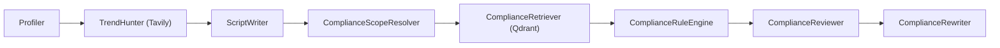

# Tavily Trend Hunter 工作说明

这份文档专门说明本项目里的 `Tavily` 是如何工作的，重点回答下面几个问题：

- Tavily 在整个系统里负责什么
- 信息是怎样流动的
- 它当前会检索什么范围的信息
- 它输出什么给后续节点
- 现在有哪些参数可以调
- 失败时系统会怎么兜底

适用代码位置：

- [core/workflow.py](/Users/bailumac/Developer/my-grad-proj/core/workflow.py)
- [core/state.py](/Users/bailumac/Developer/my-grad-proj/core/state.py)
- [core/agents/trend_hunter.py](/Users/bailumac/Developer/my-grad-proj/core/agents/trend_hunter.py)
- [utils/tavily_client.py](/Users/bailumac/Developer/my-grad-proj/utils/tavily_client.py)
- [app.py](/Users/bailumac/Developer/my-grad-proj/app.py)

## 1. Tavily 在这个项目里的作用

Tavily 目前只服务一个模块：`Trend Hunter`。

它的任务不是做法规检索，也不是做合规证据来源，而是做“创意趋势情报补充”：

- 帮 `Script Writer` 获取近期公开网络上的热点线索
- 帮脚本生成阶段补充受众痛点、流行 hook、平台表达方式
- 帮前端展示“这次趋势分析参考了哪些来源”

一句话理解：

`Tavily = 实时趋势搜索层`

而不是：

`Tavily = 法规知识库`

## 2. 它在整体工作流中的位置

当前 LangGraph 执行顺序是：



也就是说：

1. 先读创作者风格
2. 再由 `TrendHunter` 调 Tavily 搜近期趋势
3. 把趋势情报写进 `trend_data`
4. `ScriptWriter` 生成脚本时把 `trend_data` 一起带进 prompt
5. 后面的合规链路不直接依赖 Tavily

对应代码见 [core/workflow.py](/Users/bailumac/Developer/my-grad-proj/core/workflow.py)。

## 3. 信息流动

### 3.1 输入从哪里来

`TrendHunter` 会读取这些状态字段：

- `topic`
- `target_country`
- `target_platform`
- `distribution_mode`
- `product_category`
- `target_languages`

这些字段都来自页面输入，最后进入 `GraphState`，定义见 [core/state.py](/Users/bailumac/Developer/my-grad-proj/core/state.py)。

### 3.2 查询怎么构建

在 [core/agents/trend_hunter.py](/Users/bailumac/Developer/my-grad-proj/core/agents/trend_hunter.py) 里，`_build_query()` 会把上面的输入拼成一个趋势查询。

当前 query 的组成逻辑大致是：

- 主题词：`topic`
- 市场词：`United States / Brazil / Spain ...`
- 平台词：`tiktok / instagram / youtube / x / reddit / discord`
- 类目词：`electronics / beauty / fashion ...`
- 趋势意图词：`social media trend / viral hooks / creator insights / audience pain points`
- 平台提示词：不同平台会自动补不同的风格提示
- 分发模式提示词：`organic / branded_content / paid_ads`
- 语言提示词：从 `target_languages` 派生

例如，系统可能拼出类似这样的 query：

```text
MagSafe power bank for travelers United States tiktok electronics social media trend viral hooks creator insights audience pain points short-form video trends, creator hooks, UGC style, viral editing patterns focus on sponsor-safe hooks, creator-brand fit, disclosure-friendly formats content examples language en, es
```

### 3.3 Tavily 实际怎么搜

真正的 Tavily 调用在 [utils/tavily_client.py](/Users/bailumac/Developer/my-grad-proj/utils/tavily_client.py) 的 `tavily_search()`。

当前默认参数是：

- `topic="general"`
- `days=30`
- `max_results=5`
- `include_answer="advanced"`
- `include_favicon=True`
- `search_depth="basic"`
- `timeout=45`
- `country=<target_country 对应国家名>`

如果第一次搜索结果为空，并且没有 `answer`，系统会自动再试一次：

- 把 `search_depth` 从 `basic` 切到 `advanced`

### 3.4 搜到的结果怎么进入系统

Tavily 返回结果后，`TrendHunter` 会把它整理成 3 个字段：

- `trend_query`
- `trend_data`
- `trend_sources`

含义分别是：

#### `trend_query`

这次实际发给 Tavily 的 query 原文。

#### `trend_data`

给 `ScriptWriter` 用的趋势摘要文本。它是一个可直接塞进 prompt 的字符串，包含：

- Market
- Platform
- Search Query
- Summary
- Recent Signals

示意：

```text
[Live Trend Intelligence]
- Market: US
- Platform: tiktok
- Search Query: ...
- Summary: ...
- Recent Signals:
  1. ...
  2. ...
```

#### `trend_sources`

给前端展示用的来源列表。当前每个来源大致包含：

- `title`
- `url`
- `score`
- `content`

其中 `content` 会被压缩成较短摘要，用来做预览小窗。

### 3.5 后续谁消费这些结果

#### `ScriptWriter`

`trend_data` 会进入写作 prompt。

对应代码：

- [core/prompts.py](/Users/bailumac/Developer/my-grad-proj/core/prompts.py)
- [core/agents/writer.py](/Users/bailumac/Developer/my-grad-proj/core/agents/writer.py)

所以它会直接影响：

- 开头 hook
- 痛点表达
- 节奏感
- 平台原生感
- 创作者口吻

#### 前端

前端目前会展示两块和 Tavily 相关的内容：

- `Workflow Trace`
- `Trend Hunter Signals`

用途是让用户知道：

- 趋势节点确实执行了
- 当前是实时搜索还是 fallback
- 这次检索参考了哪些来源

对应代码见 [app.py](/Users/bailumac/Developer/my-grad-proj/app.py)。

## 4. 当前信息检索范围

这部分非常重要。

### 4.1 当前“会搜什么”

当前 Tavily 搜的是：

- 公开可访问网页
- 与当前 `topic + country + platform + product_category + distribution_mode` 相关的近期网络内容

典型来源可能包括：

- 平台公开页面
- 创作者内容页面
- 新闻稿
- 行业文章
- 公开讨论页
- 搜索引擎可抓到的商业站点内容

### 4.2 当前“不会自动限制成什么”

现在它还没有做这些强约束：

- 没有平台官方域名白名单
- 没有新闻站白名单
- 没有只搜某个国家站点
- 没有只搜短视频平台原生内容
- 没有品牌安全域名黑名单

所以它的本质仍然是：

`偏业务语义引导的公开网页搜索`

而不是：

`严格受控的官方数据源搜索`

### 4.3 当前范围控制靠什么

当前主要靠 3 层控制：

1. Query 文本里的限制词  
例如国家、平台、产品类目、分发方式、语言提示

2. Tavily 的 `country` 参数  
它会给搜索增加国家偏向

3. 结果数量限制  
当前只取前 `5` 条

### 4.4 这意味着什么

优点：

- 趋势情报会比较灵活
- 能更容易找到创意角度和表达方式

限制：

- 结果未必都来自官方站
- 结果质量会受 query 很大影响
- 不适合直接拿来做法律判断或合规证据

所以本项目里我们有明确分工：

- `Tavily` 负责趋势
- `Qdrant + 本地知识库` 负责合规

## 5. 当前可以调控哪些内容

可以分成 4 层来看。

### 5.1 环境层

在 [/.env](/Users/bailumac/Developer/my-grad-proj/.env) 里可以调：

- `TAVILY_API_KEY`

这是最基础的开关，没有 key 就只能走 fallback。

### 5.2 搜索参数层

在 [utils/tavily_client.py](/Users/bailumac/Developer/my-grad-proj/utils/tavily_client.py) 里当前已经在用的参数：

- `query`
- `country`
- `days`
- `max_results`
- `topic`
- `include_answer`
- `include_favicon`
- `search_depth`
- `timeout`

这些都可以继续调。

推荐理解如下：

- `days`
  作用：控制“近期”的窗口
  现在：`30`
  适合调成：`7 / 14 / 30 / 90`

- `max_results`
  作用：控制最多拿几条来源
  现在：`5`
  适合调成：`5 / 8 / 10`

- `topic`
  作用：控制搜索类型
  现在：`general`
  可选思路：某些场景可切 `news`

- `search_depth`
  作用：控制检索深度
  现在：先 `basic`，空结果再 `advanced`

- `timeout`
  作用：控制等待 Tavily 回包的最大时间
  现在：`45`

### 5.3 业务 query 层

在 [core/agents/trend_hunter.py](/Users/bailumac/Developer/my-grad-proj/core/agents/trend_hunter.py) 可以调：

- 不同平台的提示词
- 不同发布方式的提示词
- query 的关键词拼接方式
- 语言提示方式

当前已经有两套提示词字典：

- `PLATFORM_HINTS`
- `MODE_HINTS`

这是影响结果质量最核心的地方之一。

如果后面你想让它更偏：

- TikTok 爆款结构
- YouTube retention
- Reddit 社区讨论
- X 热点话题

最有效的做法通常就是改这里。

### 5.4 结果展示层

在 [app.py](/Users/bailumac/Developer/my-grad-proj/app.py) 可以调：

- 前端显示多少条来源
- 卡片显示哪些字段
- hover 预览内容长度
- 是否显示 score
- 是否显示 domain
- 是否显示 query

当前前端主要展示：

- Trend Status
- Sources Found
- Search Query
- Trend Summary
- Matched Results

## 6. 当前输出结构

### 6.1 输出给 Writer 的结构

`trend_data` 是一个字符串，不是 JSON。

这样做的原因是：

- 它直接适合塞进 prompt
- 对写作模型来说更好消费
- 减少 prompt 组装复杂度

### 6.2 输出给前端的结构

`trend_sources` 是一个列表，每项形如：

```json
{
  "title": "source title",
  "url": "https://...",
  "score": 0.91,
  "content": "short preview text"
}
```

这个结构更适合前端做：

- 标题列表
- hover 预览
- 链接跳转

## 7. 缓存机制

当前 Tavily 接入做了两层缓存。

### 7.1 Client 缓存

`get_tavily_client()` 用了：

```python
@lru_cache(maxsize=1)
```

作用：

- 整个进程里 Tavily client 只创建一次
- 避免重复初始化

### 7.2 搜索缓存

`tavily_search()` 用了：

```python
@lru_cache(maxsize=64)
```

作用：

- 相同 query + country + days + max_results 的请求会直接命中缓存
- 减少重复 API 调用
- 提升页面重复运行时的速度

这意味着：

- 同样的问题反复生成时，不一定会再次打 Tavily
- 如果你想强制重新搜，需要改 query 或清进程缓存

## 8. 失败时怎么兜底

如果 Tavily 出现这些情况：

- 没配 `TAVILY_API_KEY`
- 网络失败
- 请求超时
- API 报错

`TrendHunter` 不会让整个工作流中断，而是返回 fallback：

```text
[Trend Intelligence Fallback]
- Topic: ...
- Platform: ...
- Distribution Mode: ...
- Search Query Attempted: ...
- Live Search Status: ...
- Working Assumption: ...
```

这样做的好处是：

- `ScriptWriter` 还能继续运行
- 页面仍然能显示趋势模块
- 用户可以知道当前不是实时趋势，而是兜底模式

## 9. 当前设计的优点

- 接入轻量，趋势节点独立，不污染合规链路
- 有缓存，重复请求成本低
- 有 fallback，不会因为 Tavily 报错把整条工作流打挂
- 前端能看到来源，不是黑盒
- 查询构造能结合市场、平台、类目、分发模式

## 10. 当前设计的限制

- 还没有官方域名白名单
- 还没有平台级 include/exclude domain 控制
- 还没有把 `news` / `general` 按场景动态切换
- 还没有做“趋势来源可信度分层”
- 还没有做“同平台优先级排序”
- 目前趋势只参与写作，不参与合规判断

## 11. 最建议的后续增强

如果后面你要继续优化，我最推荐这几个方向：

### 11.1 给不同平台加域名白名单

例如：

- TikTok：优先 `tiktok.com`, `ads.tiktok.com`
- YouTube：优先 `youtube.com`, `support.google.com`
- Instagram：优先 `instagram.com`, `about.instagram.com`
- X：优先 `x.com`, `business.x.com`

这样结果会更干净。

### 11.2 区分“趋势搜索”和“新闻搜索”

例如：

- 创意题材、平台风格：`topic="general"`
- 事件营销、热点借势：`topic="news"`

### 11.3 按国家动态缩短时间窗口

例如：

- 强热点场景：`days=7`
- 常规选题：`days=30`
- 行业背景：`days=90`

### 11.4 增加来源过滤

可以在 `tavily_search()` 里加入：

- `include_domains`
- `exclude_domains`
- `time_range`
- `include_raw_content`

这会让结果更可控。

## 12. 一句话总结

当前项目中的 Tavily 不是“法律证据检索器”，而是“实时趋势情报层”。

它的工作方式是：

`读取用户输入 -> 构建趋势 query -> Tavily 搜公开网页 -> 返回 summary + source list -> 提供给 Script Writer 和前端展示`

如果你后面愿意，我下一步可以继续再写一份配套文档：

- `如何把 Tavily 从“通用趋势搜索”升级成“平台定向趋势搜索”`

或者直接帮你改代码，把：

- `include_domains`
- `exclude_domains`
- `topic=news/general`
- `days`

做成可在前端配置的高级选项。
