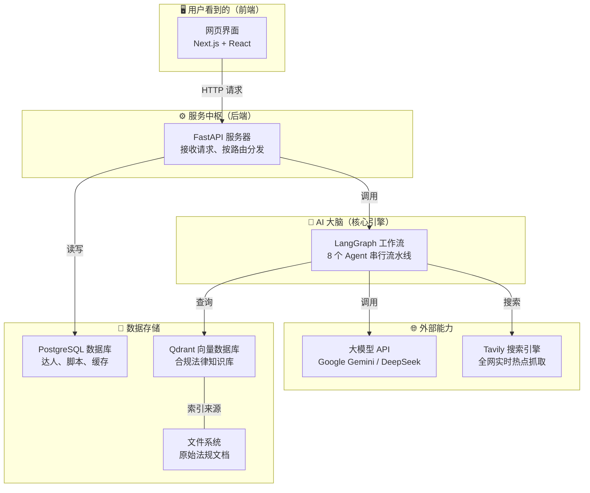
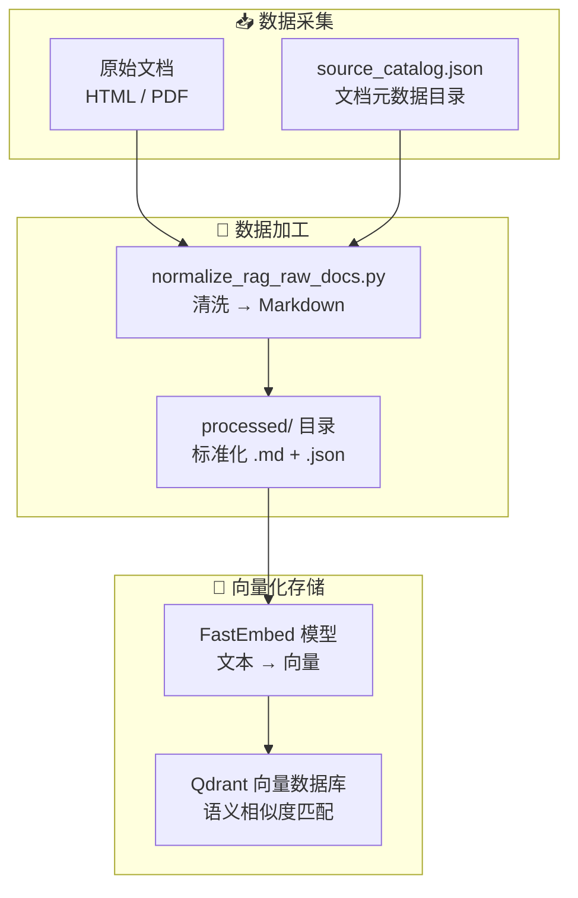
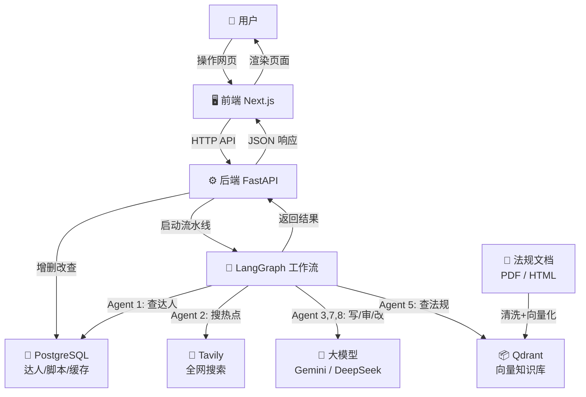

# 🎬 Pro-Script AI — 项目全景图（小白也能看懂版）

## 这个项目到底是干什么的？

一句话总结：**这是一个帮助跨境营销团队自动生成短视频拍摄脚本的 AI 应用**。

想象这样一个场景：你是一家出海品牌的营销负责人，你需要和 TikTok 达人合作拍一条短视频广告。你需要：
1. 了解这个达人的风格特点
2. 调研全网最新的热点话题
3. 写一份专业的分镜拍摄脚本（还要翻译成多种语言）
4. 检查这份脚本是否违反了目标国家的广告法、平台（比如TikTok）的投放政策
5. 如果有违规，自动修改到合规为止

**以上所有步骤，这个系统由 8 个 AI "智能员工"（Agent）全自动完成。**

---

## 整体架构一览



---

## 前端：用户看到的 5 个页面

前端使用 **Next.js 16 + React 19 + TypeScript** 构建，是一个类似"后台管理系统"的仪表盘界面。

左侧有一个固定的导航栏（Sidebar），可以切换到 5 个功能页面：

| 页面 | 路由 | 干什么用 | 对应组件文件 |
|:---|:---|:---|:---|
| **达人管理** | `/talents` | 新增/编辑/删除合作达人（KOL）的个人信息 | `components/talents/` |
| **脚本生成** | `/scripts/generate` | 填写参数（达人、主题、平台、国家等），一键生成拍摄脚本 | `components/scripts/generate-workspace.tsx` |
| **脚本检查** | `/scripts/review` | 粘贴已有脚本，让 AI 做合规审查并自动修改 | `components/scripts/review-workspace.tsx` |
| **热点探索** | `/trends` | 用 Villy（Tavily）搜索全球热点新闻、爆款视频对标 | `components/trends/trends-workspace.tsx` |
| **图书馆** | `/library` | 管理合规知识库（上传法规 PDF/HTML，重建向量索引） | `components/library/` |

### 前端如何与后端通信？

前端通过 `lib/api.ts` 文件发起 HTTP 请求到后端。所有请求都经过同一个 `fetchJson()` 工具函数，请求目标是后端的 FastAPI 服务器。

```
用户点击按钮 → api.ts 发送 HTTP 请求 → FastAPI 后端处理 → 返回 JSON 结果 → 前端渲染
```

---

## 后端：请求的调度中心

后端使用 **Python + FastAPI** 构建。它的入口文件是 `backend/main.py`，只做一件事：**接收前端的 HTTP 请求，交给对应的 service 处理，然后把结果返回给前端**。

### 后端 API 路由表

| 请求方法 | 路径 | 功能 | 交给哪个 Service |
|:---|:---|:---|:---|
| `GET` | `/talents` | 获取达人列表 | `services/talents.py` |
| `POST` | `/talents` | 新增达人 | `services/talents.py` |
| `PATCH` | `/talents/{id}` | 修改达人 | `services/talents.py` |
| `DELETE` | `/talents/{id}` | 删除达人 | `services/talents.py` |
| `POST` | `/scripts/generate` | **生成脚本（核心功能）** | `services/scripts.py` |
| `POST` | `/scripts/review` | **审核已有脚本** | `services/scripts.py` |
| `GET` | `/trends` | **热点探索** | `services/trends.py` |
| `GET` | `/library/health` | 知识库状态 | `services/library.py` |
| `GET` | `/library/documents` | 知识库文档列表 | `services/library.py` |
| `POST` | `/library/rebuild` | 重建知识库索引 | `services/library.py` |
| `POST` | `/library/upload` | 上传法规文档 | `services/library.py` |

### 数据库层

后端使用 **PostgreSQL** 数据库（通过 SQLAlchemy ORM 访问），有 4 张核心表：

| 表名 | 存什么 | 文件 |
|:---|:---|:---|
| `users` | 达人的 AI 写作风格配置（style_prompt、few_shot 示例） | `backend/models.py` |
| `talent_profiles` | 达人的联络信息（姓名、邮箱、平台、合作进度） | `backend/models.py` |
| `scripts` | 历史生成过的脚本记录 | `backend/models.py` |
| `trend_snapshots` | 热点搜索结果缓存（避免每次都重新请求 Tavily） | `backend/models.py` |

---

## AI 大脑：8 个 Agent 的流水线

这是整个系统的**灵魂**。当用户点击"生成脚本"时，后端会启动一条由 **LangGraph** 编排的 AI 流水线，依次经过 8 个"智能员工"。

用一个工厂流水线的比喻来理解：

```mermaid
graph LR
    START["📋 用户输入<br/>主题 + 参数"] --> P["👤 1. Profiler<br/>调研达人风格"]
    P --> TH["🔍 2. TrendHunter<br/>全网搜热点"]
    TH --> SW["✍️ 3. ScriptWriter<br/>写分镜脚本"]
    SW --> CSR["🧭 4. ScopeResolver<br/>确定审查范围"]
    CSR --> CR["📚 5. Retriever<br/>检索法规知识"]
    CR --> CRE["🧪 6. RuleEngine<br/>硬性规则检查"]
    CRE --> CRV["🛡️ 7. Reviewer<br/>AI 综合审查"]
    CRV --> CRW["✏️ 8. Rewriter<br/>自动改稿"]
    CRW --> END["📄 最终脚本<br/>+ 合规报告"]

    style P fill:#E8F5E9
    style TH fill:#E3F2FD
    style SW fill:#FFF3E0
    style CSR fill:#F3E5F5
    style CR fill:#F3E5F5
    style CRE fill:#F3E5F5
    style CRV fill:#F3E5F5
    style CRW fill:#F3E5F5
```



### 每个 Agent 的具体职责

#### 1. 🧑 Profiler（达人画像分析师）
- **文件**：`core/agents/profiler.py`
- **干什么**：根据用户选择的达人 ID，从数据库捞出这个达人的"写作风格"（style_prompt）和"参考作品"（few_shot），作为后续写稿的灵感源泉。
- **输出**：`style_prompt`（风格描述）、`few_shot`（样例文案）

#### 2. 🔍 TrendHunter（全网热点猎手）
- **文件**：`core/agents/trend_hunter.py`
- **干什么**：调用 **Tavily 搜索引擎**，根据主题 + 国家 + 平台 + 品类拼出搜索词，像一个超级新闻编辑一样全网抓取时下最新的热点话题和趋势数据。
- **如果搜索失败**：不会崩溃，而是自动回退到一个"通用趋势模板"继续工作。
- **输出**：`trend_data`（趋势情报摘要）、`trend_sources`（新闻源链接列表）

#### 3. ✍️ ScriptWriter（AI 编剧大脑）
- **文件**：`core/agents/writer.py`
- **干什么**：这是整条流水线里**最重的一步**。它拿着前面收集到的达人风格 + 热点数据，调用 **大语言模型（Google Gemini 或 DeepSeek）**，按照预先设计好的 Prompt 模板，生成一份完整的多语言分镜拍摄脚本（Markdown 表格格式）。
- **容错**：如果第一次用严格的表格格式校验失败了，会降级到宽松校验再试一次。
- **输出**：`final_script`（完整的多语言视频分镜脚本）

#### 4. 🧭 ComplianceScopeResolver（合规范围锁定器）
- **文件**：`core/agents/compliance_scope_resolver.py`
- **干什么**：在正式审查之前，先"框定审查范围"——把用户选择的国家、平台、语言、分发方式统一标准化（比如把"youtube shorts"映射为"youtube"，把"中文"映射为"zh"），确保后面检索知识库时用的是统一术语。
- **输出**：`compliance_scope`（标准化后的审查维度）

#### 5. 📚 ComplianceRetriever（合规证据检索员）
- **文件**：`core/agents/compliance_retriever.py`
- **干什么**：拿着脚本内容和审查范围，去 **Qdrant 向量数据库**里搜索最匹配的法规条文和平台政策。这就像律师在法律数据库里检索判例——它不是全文搜索，而是用 AI Embedding（语义向量）做模糊匹配，能找到"意思相近但用词不同"的法规。
- **输出**：`retrieved_evidence`（最多 8 条匹配的合规条文）

#### 6. 🧪 ComplianceRuleEngine（硬性规则检查器）
- **文件**：`core/agents/compliance_rule_engine.py`
- **干什么**：这是一个**不调用 AI、纯代码逻辑**的检查器。它用确定性的规则（关键词匹配、正则表达式等）扫描脚本，检查是否有"必须标注广告标识"、"禁止虚假宣传"等硬性违规。这些规则定义在 `core/compliance_rules.py` 里。
- **为什么不用 AI**：因为某些合规条款是铁律（如"品牌内容必须标 #ad"），不能靠 AI 的"模糊判断"来决定。
- **输出**：`rule_issues`（硬性规则命中列表）

#### 7. 🛡️ ComplianceReviewer（AI 合规审查官）
- **文件**：`core/agents/compliance_reviewer.py`
- **干什么**：把前面检索到的法规证据 + 硬性规则命中结果一起塞给 **大语言模型**，让 AI 做一次综合性的合规审查。把审查结果格式化为一份结构化的 JSON 合规报告（包含：整体状态、风险等级、具体问题列表、引用的法规来源、修改建议）。
- **容错**：如果 AI 没返回有效 JSON，会自动降级为只保留硬性规则检查的结果。
- **输出**：`compliance_report`（结构化合规审查报告）

#### 8. ✏️ ComplianceRewriter（合规修改师）
- **文件**：`core/agents/compliance_rewriter.py`
- **干什么**：如果上一步的报告显示"needs_revision"（需要修改），这一步会再次调用大模型，针对每一个违规点重写脚本的对应部分——在保持原有结构、语言顺序和时间码不变的前提下，把"踩红线"的表述改安全。
- **如果报告是 approved 或证据不足**：直接跳过修改，原稿即定稿。
- **输出**：`approved_script`（修订后的最终稿）

---

## 合规知识库：AI 的"法律图书馆"

这是让系统的合规审查能力"有理有据"的关键基础设施。



### 知识库里有什么？

- 各国的广告法条文（如：巴西消费者权益法第37条、欧盟不当商业行为指令）
- 平台发布政策（如：TikTok 广告投放政策、Instagram 品牌内容指南）
- 行业监管规定（如：英国 ASA 广告标准指引）

这些文档存放在 `data/knowledge_base/` 目录下：
- `raw/` — 原始爬取的 HTML 和 PDF 文件
- `processed/` — 经过清洗、标准化处理后的 Markdown 文件 + JSON 元数据
- `source_catalog.json` — 所有文档的元信息索引

### 工作原理

1. 用户在"图书馆"页面上传新的法规文档（PDF / HTML / MD）
2. 系统自动清洗并转换为标准化的 Markdown 格式
3. 点击"重建索引"后，所有文档被切块、通过 **FastEmbed** 模型转换为向量，存入 **Qdrant**
4. 当 Agent 5（ComplianceRetriever）查询时，Qdrant 会按照"语义相似度"返回最匹配的法规段落

---

## 工具层：让 AI 说话的"嘴巴"和"眼睛"

### 🧠 LLM Client（大模型客户端）
- **文件**：`utils/llm_client.py`  
- **作用**：封装了与不同大模型 API 的交互细节
- **核心特性 — 双模型容灾**：
  - **主模型**：Google Gemini 2.5 Flash（默认）
  - **备用模型**：DeepSeek Chat
  - 如果主模型挂了（超时、限流、返回空），**自动在 2 秒内切换到备用模型**继续工作，用户无感。
- **校验机制**：不同任务有不同的校验器——写脚本要求返回 Markdown 表格，合规审查要求返回 JSON。不合格就重试或容灾切换。

### 🔎 Tavily Client（全网搜索客户端）
- **文件**：`utils/tavily_client.py`
- **作用**：封装了 Tavily 搜索 API 的调用
- 支持两种搜索模式：
  - **常规搜索**（`tavily_search`）：用于 TrendHunter 抓取热点新闻
  - **视频对标搜索**（`search_viral_video_benchmarks`）：专门搜索 TikTok / Instagram / X 上的爆款视频，还能从搜索结果中自动解析播放量（如"2.3M views"）

---

## 文件地图：每个文件夹是什么

```
my-grad-proj/
│
├── frontend/                    # 🖥️ 前端（Next.js）
│   ├── app/                     #    页面路由
│   │   ├── (dashboard)/         #    仪表盘布局（侧边栏 + 顶栏）
│   │   │   ├── talents/         #    达人管理页
│   │   │   ├── scripts/         #    脚本生成 / 审核页
│   │   │   ├── trends/          #    热点探索页
│   │   │   └── library/         #    图书馆页
│   │   ├── layout.tsx           #    全局 HTML 骨架
│   │   ├── globals.css          #    全局样式
│   │   └── page.tsx             #    根页面（重定向）
│   ├── components/              #    可复用的 UI 组件
│   │   ├── layout/              #    sidebar.tsx、topbar.tsx
│   │   ├── scripts/             #    generate-workspace、review-workspace
│   │   ├── trends/              #    trends-workspace
│   │   ├── talents/             #    达人管理组件
│   │   ├── library/             #    图书馆管理组件
│   │   ├── shared/              #    共享组件
│   │   └── ui/                  #    markdown-content 等基础 UI
│   └── lib/                     #    前端工具库
│       ├── api.ts               #    所有 HTTP 请求封装
│       ├── schemas.ts           #    TypeScript 类型定义
│       └── constants.ts         #    下拉菜单选项等常量
│
├── backend/                     # ⚙️ 后端（FastAPI）
│   ├── main.py                  #    API 路由注册入口
│   ├── database.py              #    数据库连接配置（PostgreSQL）
│   ├── models.py                #    4 张数据表定义（ORM 模型）
│   ├── schemas.py               #    请求参数校验模型
│   ├── db.py                    #    数据库增删改查操作
│   └── services/                #    业务逻辑层
│       ├── scripts.py           #    脚本生成 & 审核逻辑
│       ├── trends.py            #    热点探索逻辑
│       ├── talents.py           #    达人管理逻辑
│       └── library.py           #    知识库管理逻辑
│
├── core/                        # 🧠 AI 核心引擎
│   ├── workflow.py              #    LangGraph 工作流定义（8 步流水线）
│   ├── state.py                 #    全局状态字典类型定义
│   ├── prompts.py               #    3 套 Prompt 模板（编剧/审查/改稿）
│   ├── agents/                  #    8 个 Agent 的具体实现
│   │   ├── profiler.py          #    达人画像分析
│   │   ├── trend_hunter.py      #    全网热点搜索
│   │   ├── writer.py            #    脚本创作
│   │   ├── compliance_scope_resolver.py  # 审查范围解析
│   │   ├── compliance_retriever.py       # 法规证据检索
│   │   ├── compliance_rule_engine.py     # 硬性规则判定
│   │   ├── compliance_reviewer.py        # AI 合规审查
│   │   └── compliance_rewriter.py        # 自动合规改稿
│   ├── compliance_config.py     #    国家/平台/语言的配置映射表
│   ├── compliance_rules.py      #    确定性合规规则定义
│   ├── compliance_kb.py         #    知识库管理入口
│   ├── compliance_store.py      #    Qdrant 向量数据库操作
│   └── script_cleanup.py        #    Markdown 脚本清洗工具
│
├── utils/                       # 🔧 工具层
│   ├── llm_client.py            #    大模型客户端（双模型容灾）
│   └── tavily_client.py         #    Tavily 搜索 API 客户端
│
├── data/                        # 💾 数据
│   ├── knowledge_base/          #    合规知识库文件
│   │   ├── raw/                 #    原始 HTML / PDF 法规文档
│   │   ├── processed/           #    清洗后的 Markdown + JSON
│   │   └── source_catalog.json  #    文档元信息索引
│   └── qdrant/                  #    Qdrant 向量数据库本地存储
│
├── scripts/                     # 🛠️ 运维与工具脚本
│   ├── start_backend.sh         #    一键启动后端
│   ├── start_frontend.sh        #    一键启动前端
│   ├── crawl_rag_sources.py     #    爬取法规原始文档
│   ├── normalize_rag_raw_docs.py #   清洗原始文档为 Markdown
│   ├── build_compliance_index.py #   构建 Qdrant 向量索引
│   ├── prepare_postgres.py      #    初始化 PostgreSQL 数据库
│   └── migrate_sqlite_to_postgres.py  # 从 SQLite 迁移到 PostgreSQL
│
├── alembic/                     # 📐 数据库版本管理（Alembic）
├── docs/                        # 📖 项目文档
└── .env                         # 🔑 环境变量（API Key 等敏感配置）
```

---

## 三大核心流程总结

### 流程 1：生成脚本（最复杂）
```
用户点击"生成" → 前端 POST /scripts/generate
  → 后端 build_workflow().invoke()
    → Profiler 查达人风格
    → TrendHunter 搜全网热点
    → ScriptWriter 调大模型写多语言脚本
    → ScopeResolver 标准化审查范围
    → Retriever 从 Qdrant 检索法规
    → RuleEngine 硬性规则扫描
    → Reviewer 调大模型综合评审
    → Rewriter 调大模型自动改稿
  → 返回：原稿 + 修订稿 + 合规报告
→ 前端渲染结果
```

### 流程 2：热点探索
```
用户点击"刷新" → 前端 GET /trends
  → 后端 explore_trends()
    → 先查数据库缓存、如需刷新则：
      → Tavily 搜爆款视频对标
      → Tavily 搜科技/视频/营销三类行业情报
      → TrendHunter Agent 做趋势总结
    → 结果存入缓存表（下次不用再搜）
  → 返回：视频列表 + 行业洞察 + 趋势摘要
→ 前端渲染卡片
```

### 流程 3：脚本审核
```
用户粘贴脚本并点击"审核" → 前端 POST /scripts/review
  → 后端依次调用 5 个合规 Agent：
    → ScopeResolver → Retriever → RuleEngine → Reviewer → Rewriter
  → 返回：修订稿 + 合规报告
→ 前端渲染结果
```

---

## 一张图看懂所有数据流向



> **小结**：这个系统的核心价值在于：**把"调研 → 创作 → 审查 → 修改"这条原本需要市场部、法务部、翻译团队协同的人工链路，压缩成了一键触发、8 个 AI Agent 全自动执行的流水线**。
