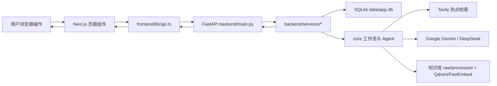

# 全系统功能测试报告

测试时间：2026-04-10 08:07 CST  
测试项目：达人管理、脚本生成、脚本检查、热点探索、图书馆  
测试目标：验证五个一级功能的后端逻辑、前后端接口同步、数据写入与清理、外部服务降级与缓存机制是否可用。

## 1. 测试环境

| 项目 | 内容 |
| --- | --- |
| 项目路径 | `/Users/bailumac/Developer/my-grad-proj` |
| Python 环境 | `venv` |
| 后端服务 | FastAPI, 临时测试地址 `http://127.0.0.1:8010` |
| 后端启动命令 | `venv/bin/uvicorn backend.main:app --port 8010` |
| 前端框架 | Next.js 16.2.3, pnpm 10.7.0, Node 22 |
| 数据库 | SQLite, `data/app.db` |
| 知识库 | `data/knowledge_base/raw`, `data/knowledge_base/processed`, 本地 Qdrant/FastEmbed 索引 |
| 外部服务 | Tavily, Google Gemini, DeepSeek |

## 2. 总体结论

| 类型 | 结果 |
| --- | --- |
| 核心自动化接口用例 | 18 / 18 通过 |
| 脚本审查改写专项复测 | 1 / 1 通过 |
| 前端生产构建 | 1 / 1 通过 |
| 失败功能 | 0 个 |
| 需要关注的警告 | 3 个 |

本轮测试中，五个一级模块均能通过后端接口完成主要业务闭环；前端页面与接口类型能通过 `pnpm build`，说明目前前后端代码层面的接口同步没有阻断问题。

测试过程中发现“脚本检查”的建议修订稿在严格 Markdown 表格校验失败后会直接回退原文。已修复为严格校验失败后再使用非空文本宽松校验，并完成 `/scripts/review` 专项复测。

## 3. 测试范围与结果

### 3.1 基础设施与前后端同步

| 测试功能 | 测试方法 | 判断标准 | 结果 | 证据与备注 |
| --- | --- | --- | --- | --- |
| 后端服务启动 | 使用 `uvicorn backend.main:app --port 8010` 启动临时服务 | 服务可启动，应用完成 startup | 成功 | 后端返回 `Application startup complete` |
| 健康检查 | 请求 `GET /health` | HTTP 200 | 成功 | 接口可用 |
| 后端模块导入 | 使用 Python 导入 `backend.main` | 无导入异常 | 成功 | 说明主服务依赖可加载 |
| 前端构建 | 在 `frontend` 下运行 `pnpm build` | Next.js 构建通过 | 成功 | 路由包含 `/talents`, `/scripts/generate`, `/scripts/review`, `/trends`, `/library` |
| 前后端字段同步 | 对照前端 `frontend/lib/api.ts`, `frontend/lib/schemas.ts` 与后端 Pydantic schema | 请求字段与响应消费字段一致 | 成功 | 构建通过，核心接口测试通过 |

### 3.2 功能一：达人管理

| 测试功能 | 测试方法 | 判断标准 | 结果 | 证据与备注 |
| --- | --- | --- | --- | --- |
| 查询达人列表 | 请求 `GET /talents` | HTTP 200，返回列表结构 | 成功 | 前端表格页可消费该列表 |
| 新增达人 | 请求 `POST /talents`，提交达人 ID 所需字段之外的业务字段：平台、邮箱、近期视频链接、备注、合作进度 | 返回新增达人记录 | 成功 | 测试创建达人 ID 7 |
| 新增达人同步 users | 新增达人后直接查询 SQLite `users` 表 | 新增达人时同步创建对应 user | 成功 | 测试 user ID 7 被创建 |
| 修改达人资料 | 请求 `PATCH /talents/{id}`，修改平台、邮箱、链接、备注、合作进度 | 返回修改后的字段 | 成功 | 字段可更新 |
| 修改达人同步 users | 修改达人后查询 `users.style_prompt` | 达人备注同步到 user 风格描述 | 成功 | 保持脚本生成可读取达人风格 |
| 删除达人 | 请求 `DELETE /talents/{id}` | 达人记录删除 | 成功 | 删除测试达人后 `talent_profiles` 无残留 |
| 删除达人同步 users | 删除达人后查询 `users` | 对应 user 同步删除 | 成功 | 满足“删达人时也删 users”的要求 |
| 删除达人保留历史 scripts | 删除前插入关联测试脚本，再删除达人 | 历史脚本保留，`user_id` 置空 | 成功 | 满足“保留历史 scripts”的要求 |
| 测试数据清理 | 查询 `talent_profiles`, `users`, `scripts` | 自动化测试数据为 0 | 成功 | `test_talents=0`, `test_users=0`, `test_scripts=0` |

结论：达人管理 CRUD、users 联动、历史 scripts 保留逻辑完整，没有发现数据冲突。

### 3.3 功能二：脚本生成

| 测试功能 | 测试方法 | 判断标准 | 结果 | 证据与备注 |
| --- | --- | --- | --- | --- |
| 生成接口可用 | 请求 `POST /scripts/generate` | HTTP 200 | 成功 | 接口正常返回 |
| 达人选择 | 请求体传入 `user_id` | 后端能读取用户风格 | 成功 | 生成链路进入 Profiler |
| 平台调节 | 请求体传入 `target_platform=tiktok` | 参数进入工作流初始状态 | 成功 | `initial_state` 保留该字段 |
| 时长调节 | 请求体传入 `video_duration` | 参数进入工作流初始状态 | 成功 | `initial_state` 保留该字段 |
| 品牌调节 | 请求体传入 `brand_id` | 参数进入工作流初始状态 | 成功 | `initial_state` 保留该字段 |
| 温度/创意调节 | 请求体传入 `creativity` | LLM 调用使用该配置 | 成功 | 字段传入 writer |
| 语言调节 | 请求体传入 `target_languages` | 生成结果按语言参数执行 | 成功 | writer 读取语言顺序 |
| 趋势增强 | 生成链路调用 Tavily 趋势检索 | 有趋势数据参与脚本生成 | 成功 | 日志显示 Tavily 返回 5 条实时结果 |
| 合规检查 | 生成链路经过合规审查 | 返回 `compliance_report` | 成功 | 结果包含合规报告 |
| 持久化保存 | `persist_result=true` | 生成脚本写入 `scripts` 表 | 成功 | 测试保存记录 ID 45，清理成功 |

结论：脚本生成从达人资料、趋势检索、LLM 生成、合规审查到数据库保存的链路可用。当前 Google Gemini 主服务因权限返回 403，系统自动降级 DeepSeek 后仍可完成生成。

### 3.4 功能三：脚本检查

| 测试功能 | 测试方法 | 判断标准 | 结果 | 证据与备注 |
| --- | --- | --- | --- | --- |
| 审查接口可用 | 请求 `POST /scripts/review` | HTTP 200 | 成功 | 接口正常返回 |
| 输入脚本审查 | 提交包含绝对化医疗/功效承诺、未披露赞助等风险文案 | 返回风险报告 | 成功 | `overall_status=needs_revision` |
| 风险等级判定 | 检查 `compliance_report.overall_risk` | 高风险内容应被识别 | 成功 | `overall_risk=high` |
| 规则引擎命中 | 检查 `rule_issues` | 命中确定性规则 | 成功 | 原完整测试命中 2 个规则问题，专项复测命中 5 个问题 |
| 知识库证据命中 | 检查 `retrieved_evidence` | 返回法规/平台政策证据 | 成功 | 专项复测命中 8 条证据 |
| 建议修订稿 | 检查 `approved_script` | 非空，并对风险内容进行改写 | 成功 | 修复后专项复测 `approved_script_changed=True` |
| 前端结果展示 | 构建 `frontend/components/scripts/review-workspace.tsx` | 风险报告、修订稿、证据区构建通过 | 成功 | `pnpm build` 通过 |

发现与处理：  
原逻辑中 `core/agents/compliance_rewriter.py` 使用严格 Markdown 表格校验，模型返回非表格但有效的修订稿时会被判定失败，并退回原文。已增加宽松非空校验兜底，专项复测通过。

结论：脚本检查的风险判定、证据检索、规则引擎和修订稿生成均可用。

### 3.5 功能四：热点探索

| 测试功能 | 测试方法 | 判断标准 | 结果 | 证据与备注 |
| --- | --- | --- | --- | --- |
| 热点接口可用 | 请求 `GET /trends` | HTTP 200 | 成功 | 接口正常返回 |
| 不刷新展示上次内容 | 首次无刷新请求 | 返回缓存内容 | 成功 | `videos_from_cache=true`, `industry_from_cache=true` |
| 刷新热点视频 | 请求 `GET /trends?refresh_videos=true` | 视频数据实时刷新，行业信息仍走缓存 | 成功 | 返回 6 条视频，`videos_from_cache=false` |
| 刷新行业信息 | 请求 `GET /trends?refresh_industry=true` | 行业信息实时刷新，视频仍走缓存 | 成功 | 行业分类 3 个，`industry_from_cache=false` |
| 再次无刷新 | 刷新后再次请求 `GET /trends` | 展示刚才缓存内容，不重复慢加载 | 成功 | 两类内容均 `from_cache=true` |
| 科技/视频/营销信息 | 检查返回 industry categories | 包含多行业模块 | 成功 | 返回 3 个行业分类 |
| 前端展示 | 构建 `frontend/components/trends/trends-workspace.tsx` | 页面构建通过 | 成功 | 支持刷新、封面、复制链接 |

结论：热点探索的实时 Tavily 抓取、视频与行业信息分开刷新、缓存复用逻辑可用。

### 3.6 功能五：图书馆

| 测试功能 | 测试方法 | 判断标准 | 结果 | 证据与备注 |
| --- | --- | --- | --- | --- |
| 健康检查 | 请求 `GET /library/health` | 返回 ready 状态 | 成功 | `status=ready`, 文档 31 个，chunks 1211 个 |
| 文档列表 | 请求 `GET /library/documents` | 返回 source catalog 文档列表 | 成功 | 初始列表 total 33 |
| 添加 TXT 资料 | 请求 `POST /library/upload`，上传测试 txt | 创建 raw/source_catalog 记录 | 成功 | 返回 `pending_rebuild` |
| 添加 HTML/RAW 资料 | 请求 `POST /library/upload`，上传测试 html | 创建 raw/source_catalog 记录 | 成功 | 返回 `pending_rebuild` |
| 上传后列表同步 | 上传后请求 `GET /library/documents` | 新文档显示为待重建 | 成功 | 两个测试文档均出现 |
| 刷新/重建知识库 | 请求 `POST /library/rebuild` | raw 转 processed，并重建索引 | 成功 | `runtime_status=rebuilt`, raw_files 34, processed_documents 34 |
| 重建后状态 | 再次请求 `GET /library/documents` | 测试文档变为 indexed | 成功 | 两个测试文档均可被索引 |
| 测试数据清理 | 删除测试 raw/source 记录后再次 rebuild | 测试文件无残留，索引回到原状态 | 成功 | `find data/knowledge_base -name 'test_library_*'` 无输出 |
| 前端页面 | 构建 `frontend/components/library/library-workspace.tsx` | 健康、列表、上传、刷新入口构建通过 | 成功 | `pnpm build` 通过 |

结论：图书馆的健康检查、添加资料、资料列表、刷新知识库、索引重建流程可用。

注意：图书馆重建会重新生成 `data/knowledge_base/processed` 和 `source_catalog.json`，因此本轮测试后这些生成产物出现格式/顺序类 diff。这属于重建知识库的副作用，不是业务失败。

## 4. 失败项与警告项

### 失败项

| 功能 | 失败描述 | 当前状态 |
| --- | --- | --- |
| 无 | 本轮没有发现阻断性失败功能 | 无需标记 |

### 警告项

| 警告 | 影响 | 建议 |
| --- | --- | --- |
| Google Gemini 当前返回 403 `API_KEY_SERVICE_BLOCKED` | 生成/审查会先失败一次再降级 DeepSeek，耗时增加 | 检查 Google API Key 权限，或将默认 provider 临时切到 DeepSeek |
| 脚本生成和脚本审查依赖外部 LLM | 网络慢或 API 抖动时接口耗时较长 | 前端保留 loading；后续可改异步任务队列或 SSE 进度 |
| 图书馆 rebuild 会更新生成文件 | Git 工作区会出现 `data/knowledge_base/processed` 与 `source_catalog.json` 变更 | 若不希望提交生成产物，提交前单独决定是否保留 |

## 5. 测试清理记录

| 清理对象 | 结果 |
| --- | --- |
| 测试达人 | 已删除 |
| 测试 users | 已删除 |
| 测试 scripts | 已删除 |
| 测试图书馆 raw 文件 | 已删除 |
| 测试 source_catalog 记录 | 已删除 |
| 测试后知识库索引 | 已重新 rebuild |
| 临时后端服务 | 已关闭 |

清理后核验结果：

```text
test_talents=0
test_users=0
test_scripts=0
find data/knowledge_base -name 'test_library_*' 无输出
```

## 6. 前后端接口映射

| 一级菜单 | 前端页面 | 主要后端接口 | 当前状态 |
| --- | --- | --- | --- |
| 达人管理 | `/talents` | `GET/POST/PATCH/DELETE /talents` | 已接通 |
| 脚本生成 | `/scripts/generate` | `POST /scripts/generate` | 已接通 |
| 脚本检查 | `/scripts/review` | `POST /scripts/review` | 已接通 |
| 热点探索 | `/trends` | `GET /trends` | 已接通 |
| 图书馆 | `/library` | `GET /library/health`, `GET /library/documents`, `POST /library/upload`, `POST /library/rebuild` | 已接通 |

## 7. 跑通所有流程后的系统信息流动

整体信息流：



分模块信息流：

| 模块 | 信息流 |
| --- | --- |
| 达人管理 | 用户在 `TalentTable` 新增/编辑/删除达人，前端调用 `/talents`，后端 `backend.services.talents` 写入 `talent_profiles`，并同步维护 `users`；删除达人时删除 users，但通过外键置空保留历史 scripts |
| 脚本生成 | 用户在 `GenerateWorkspace` 选择达人、平台、时长、品牌、温度等参数，前端调用 `/scripts/generate`，后端进入 `core.workflow`，依次执行 Profiler、Trend Hunter、Writer、Compliance Scope、Retriever、Rule Engine、Reviewer、Rewriter，最终可写入 `scripts` 表并返回前端 |
| 脚本检查 | 用户在 `ReviewWorkspace` 输入或粘贴脚本，前端调用 `/scripts/review`，后端直接进入合规链路，基于国家、平台、分发模式、品类解析范围，检索知识库证据，运行规则引擎和 LLM 审查，返回风险报告、证据列表和建议修订稿 |
| 热点探索 | 用户进入 `TrendsWorkspace` 时默认请求 `/trends` 读取上次缓存；点击刷新视频时只刷新 Tavily 视频结果；点击刷新行业时只刷新科技、视频、营销等行业信息；结果写入趋势快照后返回页面 |
| 图书馆 | 用户在 `LibraryWorkspace` 查看健康状态和文档列表，上传资料时调用 `/library/upload` 写入 raw 与 source catalog；点击刷新调用 `/library/rebuild`，系统将 raw 资料标准化为 processed 文档，重建本地知识库索引，后续脚本生成和脚本检查会从该索引检索合规证据 |

最终结论：当前系统已经从原 Python 功能拆分为可被前端调用的后端接口，并且五个一级菜单的主要流程已经跑通。下一阶段更适合继续做浏览器级 E2E 测试、用户权限、长任务进度展示和错误提示优化。
