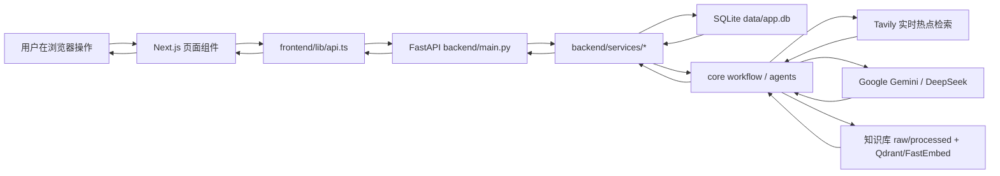

# 人类行为全流程测试报告

测试时间：2026-04-10 08:38 CST  
测试方式：使用 Headless Chrome + Chrome DevTools Protocol 模拟用户在前端页面中点击菜单、填写表单、选择下拉项、拖动滑杆、上传文件、点击刷新与删除按钮。  
测试入口：前端 `http://127.0.0.1:3000`，后端 `http://127.0.0.1:8000`。

## 1. 测试结论

| 项目 | 结果 |
| --- | --- |
| 五个一级菜单页面 | 通过 |
| 人类行为主流程用例 | 首轮 9 / 10 通过 |
| 首轮失败项复测 | 1 / 1 通过 |
| 温度滑杆真实拖动复测 | 1 / 1 通过 |
| 脚本检查证据链补充核验 | 1 / 1 通过 |
| 前端生产构建 | 通过 |
| 最终未解决失败功能 | 0 个 |

最终判定：达人管理、脚本生成、脚本检查、热点探索、图书馆五个一级功能均已跑通。首轮唯一失败来自测试脚本等待条件过窄，页面状态与后续复测均证明功能实际成功。

## 2. 测试环境

| 项目 | 内容 |
| --- | --- |
| 项目路径 | `/Users/bailumac/Developer/my-grad-proj` |
| 后端服务 | FastAPI, `uvicorn backend.main:app --reload` |
| 前端服务 | Next.js dev server, `http://127.0.0.1:3000` |
| 浏览器 | Headless Chrome 146, CDP 临时端口 `9223` |
| 数据库 | SQLite, `data/app.db` |
| 知识库 | `data/knowledge_base/raw`, `data/knowledge_base/processed`, 本地 Qdrant/FastEmbed |
| 外部服务 | Tavily, Google Gemini, DeepSeek |

## 3. 测试方法

| 方法 | 说明 |
| --- | --- |
| 页面行为测试 | 从侧边栏进入页面，按真实用户顺序填写表单、点击按钮、等待页面反馈 |
| 网络同步验证 | 捕获浏览器发出的后端 API 请求，检查 `/talents`, `/scripts/generate`, `/scripts/review`, `/trends`, `/library/*` 状态码 |
| 数据库核验 | 对达人、users、scripts 的联动结果进行 SQLite 查询 |
| 文件与知识库核验 | 对图书馆上传生成的 processed 文件、索引重建结果进行检查 |
| 聚焦复测 | 对首轮误报项和温度滑杆做单独复测 |
| 构建验证 | 执行 `pnpm build`，确认前端路由与类型构建通过 |

## 4. 功能测试明细

### 4.1 导航与布局

| 测试功能 | 模拟用户行为 | 判断标准 | 结果 | 证据 |
| --- | --- | --- | --- | --- |
| 五个一级菜单展示 | 打开系统，读取侧边栏菜单 | 应包含达人管理、脚本生成、脚本检查、热点探索、图书馆 | 成功 | 菜单显示：达人管理、脚本生成、脚本检查、热点探索、图书馆 |
| 页面路由可进入 | 点击侧边栏进入不同页面 | 页面路径与标题变化正常 | 成功 | `/talents`, `/scripts/generate`, `/scripts/review`, `/trends`, `/library` 均可访问 |

### 4.2 功能一：达人管理

| 测试功能 | 模拟用户行为 | 判断标准 | 结果 | 证据 |
| --- | --- | --- | --- | --- |
| 新增达人 | 在达人管理页填写达人名称、平台、邮箱、近期视频链接、备注描述、合作进度，点击“新增达人” | 表格出现新达人 | 成功 | 新增 `talent_id=8`, `user_id=8` |
| 编辑达人 | 点击该达人行的“编辑”，修改名称、备注描述、合作进度，点击“保存修改” | 表格显示新名称和“已寄样”状态 | 成功 | 刷新列表后仍显示编辑后的达人 |
| 刷新列表 | 点击“刷新达人列表” | 前端数据与后端最新数据一致 | 成功 | 刷新后编辑结果未丢失 |
| 删除达人 | 点击该达人行的“删除”，确认浏览器弹窗 | 表格不再显示该达人 | 成功 | UI 删除成功 |
| 删除 users 联动 | 删除后查询 SQLite | 对应 `users` 被删除 | 成功 | `users_remaining=0` |
| 保留历史 scripts | 删除达人前先通过脚本生成保存历史脚本，删除达人后查询 SQLite | 历史脚本保留，`user_id` 置空 | 成功 | 测试脚本 `id=46`, 删除达人后 `user_id=NULL` |

结论：达人 CRUD、前端刷新、`talent_profiles` 与 `users` 联动、历史 scripts 保留逻辑完整。

### 4.3 功能二：脚本生成

| 测试功能 | 模拟用户行为 | 判断标准 | 结果 | 证据 |
| --- | --- | --- | --- | --- |
| 选择达人 | 在脚本生成页选择刚创建并编辑过的达人 | 达人档案显示正确 | 成功 | 页面读取到达人资料 |
| 输入主题 | 在主题框输入 AI wearable launch 主题 | 生成按钮可点击 | 成功 | 表单状态正常 |
| 调节平台 | 选择 TikTok | 请求进入 `/scripts/generate` | 成功 | 浏览器网络记录 `POST /scripts/generate 200` |
| 调节国家 | 选择 United States | 参数参与生成链路 | 成功 | 请求成功 |
| 调节分发方式 | 选择 Branded Content | 参数参与生成链路 | 成功 | 请求成功 |
| 调节品类 | 选择 Electronics | 参数参与生成链路 | 成功 | 请求成功 |
| 调节时长 | 选择 `15s (Flash)` | 页面结果展示平台/时长 | 成功 | 生成记录保存 `duration=15s (Flash)` |
| 调节品牌 | 输入 `human-brand-*` | 页面结果展示品牌 | 成功 | 页面 `brandVisible=true` |
| 调节温度 | 通过真实鼠标拖动 range 滑杆到 0.6 | 页面标签更新为 `温度 / Creativity: 0.6` | 成功 | 聚焦复测 `labelUpdated=true`, `rangeValue=0.6` |
| 生成脚本 | 点击“运行 /scripts/generate” | 返回模型信息、生成稿、修订稿 | 成功 | `deepseek · deepseek-chat`, 生成稿长度约 2416，修订稿长度约 2489 |
| 保存脚本记录 | 选择“是，写入脚本记录” | `scripts` 表出现记录 | 成功 | 测试脚本保存为 `id=46`，清理前内容长度 2415 |

注意：测试环境中 Google Gemini 仍返回权限错误，系统自动降级到 DeepSeek；本次页面最终使用 DeepSeek 成功生成。

### 4.4 功能三：脚本检查

| 测试功能 | 模拟用户行为 | 判断标准 | 结果 | 证据 |
| --- | --- | --- | --- | --- |
| 输入脚本 | 在脚本检查页输入含绝对化功效承诺、医生推荐、未披露赞助等高风险脚本 | 检查按钮可点击 | 成功 | 表单可提交 |
| 选择达人与上下文 | 选择达人、国家、平台、分发方式、品类、品牌 | 请求进入 `/scripts/review` | 成功 | 浏览器网络记录 `POST /scripts/review 200` |
| 风险判定 | 点击“运行 /scripts/review” | 返回 `needs_revision` 和 `high` | 成功 | 页面显示高风险与需修改 |
| 建议修订稿 | 检查修订稿区域 | 修订稿非空，且去掉原脚本中 `guaranteed to cure` 等高风险表述 | 成功 | 人类行为测试中修订稿长度约 209 |
| 证据链 | 补充请求 `/scripts/review` 核验后端返回 | 应命中法规/平台政策证据 | 成功 | `retrieved_evidence=8`, `rule_issues=3`, `issues=6` |

结论：脚本检查页面、后端规则引擎、知识库证据检索、LLM 审查与修订稿生成均可用。

### 4.5 功能四：热点探索

| 测试功能 | 模拟用户行为 | 判断标准 | 结果 | 证据 |
| --- | --- | --- | --- | --- |
| 读取缓存内容 | 在热点探索页输入主题，点击“读取已缓存内容” | 页面不报错，展示上次内容 | 成功 | 网络请求 `/trends` 返回 200 |
| 刷新热点视频 | 点击“刷新热点视频” | 页面出现视频卡片或空状态，不阻塞 | 成功 | 返回 4 个视频卡片 |
| 视频封面 | 查看视频卡片 | 卡片包含封面图 | 成功 | `images=4` |
| 一键复制链接 | 点击视频卡片“复制链接” | 按钮反馈“已复制链接” | 成功 | `hasCopySuccess=true` |
| 刷新行业情报 | 点击“刷新行业情报” | 页面显示“已实时刷新”，并出现行业信息 | 首轮误报，复测成功 | 首轮页面状态已含“已实时刷新”；聚焦复测 `industryCards=3`, `hasRecentSignals=true` |

失败标记说明：首轮“刷新行业情报”被标记失败，原因是测试脚本等待条件要求页面同时出现英文标题 `Industry Signals`。实际页面在首轮失败快照中已经显示“行业情报摘要”“已实时刷新”和 Tavily 返回的 Recent Signals。随后单独复测通过，因此最终不作为功能失败。

### 4.6 功能五：图书馆

| 测试功能 | 模拟用户行为 | 判断标准 | 结果 | 证据 |
| --- | --- | --- | --- | --- |
| 查看图书馆状态 | 进入图书馆页，等待状态和文档清单加载 | 页面展示状态、文档数、分块数 | 成功 | 页面显示图书馆状态和资料清单 |
| 上传资料 | 选择本地 txt 文件，填写标题、分类、优先级、市场、区域包、平台、语言、来源链接、备注，点击“上传资料” | 页面出现上传成功提示 | 成功 | 上传标题 `Human Library Test 20260410002402` |
| 刷新文档列表 | 点击“刷新文档列表” | 新资料出现在列表 | 成功 | 表格中出现上传资料 |
| 重建图书馆 | 点击“刷新 / 重建图书馆” | 页面提示重建完成 | 成功 | `扫描 33 份原始资料，输出 33 份规范化文档` |
| 入库状态 | 查看上传资料行 | 状态变为“已入库” | 成功 | 行状态显示已入库 |
| 清理与重建 | 删除测试 processed 文件和测试脚本，重新 rebuild | 测试数据无残留 | 成功 | `talents=0`, `users=0`, `scripts=0`, `processed_exists=False` |

结论：图书馆的状态展示、文件上传、资料列表刷新、知识库 rebuild、索引更新均可用。

## 5. 前后端同步与冲突检查

| 检查点 | 结果 |
| --- | --- |
| 浏览器网络请求 | 本轮捕获的后端接口均为 200，无 4xx/5xx |
| `/talents` | `GET/POST/PATCH/DELETE` 均成功 |
| `/scripts/generate` | `POST` 成功，页面展示生成稿和修订稿 |
| `/scripts/review` | `POST` 成功，页面展示风险报告和修订稿 |
| `/trends` | 缓存、刷新视频、刷新行业情报均成功 |
| `/library/health` | `GET` 成功 |
| `/library/documents` | `GET` 成功 |
| `/library/upload` | `POST` 成功 |
| `/library/rebuild` | `POST` 成功 |
| 前端构建 | `pnpm build` 成功，路由包含 `/talents`, `/scripts/generate`, `/scripts/review`, `/trends`, `/library` |

## 6. 失败项与风险项

### 6.1 失败项

| 功能 | 首轮状态 | 处理结果 | 最终状态 |
| --- | --- | --- | --- |
| 热点探索：刷新行业情报 | 首轮被测试脚本标记失败 | 检查失败快照发现页面已实时刷新；调整判断标准后聚焦复测 | 成功 |

当前没有未解决的功能失败。

### 6.2 风险项

| 风险 | 影响 | 建议 |
| --- | --- | --- |
| Google Gemini API 当前返回 403 | 脚本生成/审查会先触发降级，增加耗时 | 检查 Google API Key 权限，或将默认 provider 切到 DeepSeek |
| LLM 与 Tavily 属于外部服务 | 网络慢时脚本生成、脚本检查、热点刷新会等待较久 | 后续可加入 SSE/WebSocket 进度条或后台任务队列 |
| 图书馆 rebuild 会改写生成产物 | `data/knowledge_base/processed` 和 `source_catalog.json` 会出现 Git diff | 提交前决定是否保留生成产物，或将部分生成文件加入忽略策略 |
| 浏览器自动化不是人工肉眼验收 | CDP 能模拟点击/填写/拖动，但不能完全替代最终手工验收 | 答辩或演示前建议再手动点一遍五个页面 |

## 7. 测试数据清理记录

| 数据 | 清理结果 |
| --- | --- |
| 测试达人 | 已通过 UI 删除 |
| 测试 users | 删除达人时联动删除 |
| 测试 scripts | 已在验证历史保留后删除 |
| 测试图书馆 processed 文件 | 已删除 `my_grad_proj_human_library_test.json/.md` |
| 知识库索引 | 清理后已重新 rebuild |
| Headless Chrome | 临时测试进程已关闭 |

清理核验：

```text
talents=0
users=0
scripts=0
processed_exists=False
rebuild_runtime_status=rebuilt
rebuild_documents=32
rebuild_chunks=1212
```

## 8. 跑通所有流程后的系统信息流动

整体信息流如下：



分模块信息流：

| 模块 | 信息流 |
| --- | --- |
| 达人管理 | 用户在 `/talents` 页面新增、编辑、删除达人，前端调用 `/talents`，后端写入 `talent_profiles` 并同步维护 `users`；删除达人时同步删除 `users`，历史 `scripts.user_id` 置空保留 |
| 脚本生成 | 用户在 `/scripts/generate` 选择达人、平台、国家、分发方式、品类、时长、品牌和温度，前端调用 `/scripts/generate`，后端进入 `core.workflow`，依次使用达人画像、Tavily 趋势、LLM Writer、合规检索与审查，最终返回生成稿、修订稿、合规报告，并按选择写入 `scripts` |
| 脚本检查 | 用户在 `/scripts/review` 输入脚本和上下文参数，前端调用 `/scripts/review`，后端解析合规范围，检索知识库证据，运行规则引擎和 LLM Reviewer/Rewriter，返回风险等级、问题列表、证据和建议修订稿 |
| 热点探索 | 用户在 `/trends` 读取缓存或点击刷新，前端调用 `/trends`；不刷新时读取上次快照，刷新视频时更新视频模块，刷新行业情报时更新科技、视频、营销等行业信号，结果返回页面并缓存 |
| 图书馆 | 用户在 `/library` 查看健康状态、上传资料、刷新文档列表或 rebuild，前端调用 `/library/health`, `/library/documents`, `/library/upload`, `/library/rebuild`；后端将资料写入知识库文件体系，标准化为 processed 文档，重建 Qdrant/FastEmbed 索引，供脚本生成与脚本检查检索证据 |
