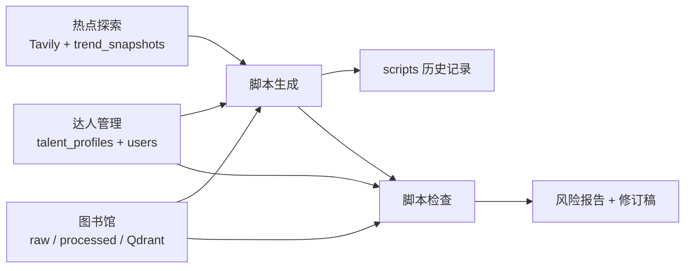
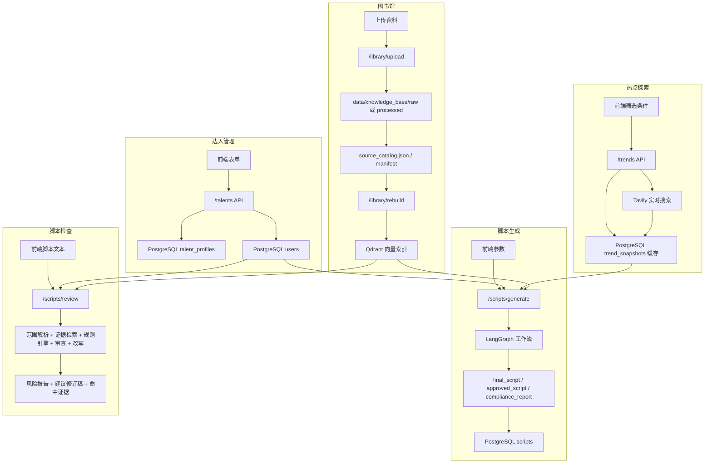
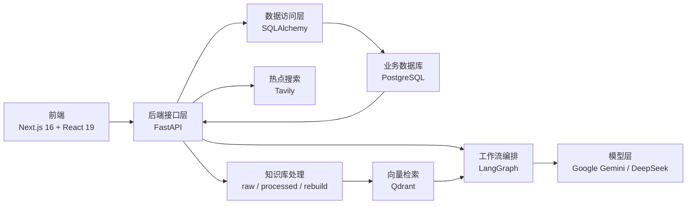

# 五个核心界面总览

这份文档把以下 5 个界面合并到一起做总览：

1. 达人管理
2. 脚本生成
3. 脚本检查
4. 热点探索
5. 图书馆

如果你想先理解“每个界面负责什么”，再理解“它们之间怎么串起来”，看这份最合适。

## 一、五个界面的角色分工

### 1. 达人管理

作用：

- 维护达人资料
- 维护达人风格来源
- 给脚本生成和脚本审查提供人物上下文

核心输入：

- 达人名称
- 平台
- 邮箱
- 近期视频链接
- 备注描述
- 合作进度

核心输出：

- `talent_profiles`
- 同步维护 `users`

对应详细文档：

- [talents_interface_guide.md](/Users/bailumac/Developer/my-grad-proj/docs/interfaces/talents_interface_guide.md)

### 2. 脚本生成

作用：

- 根据达人风格、主题、平台、市场和品类生成拍摄脚本
- 自动附带合规判断和修订稿

核心输入：

- 达人
- 主题
- 输出语言
- 国家
- 平台
- 分发方式
- 品类
- 时长
- 品牌 ID
- 温度

核心输出：

- 生成稿
- 修订稿
- 合规报告
- 可选写入 `scripts`

对应详细文档：

- [scripts_generate_interface_guide.md](/Users/bailumac/Developer/my-grad-proj/docs/interfaces/scripts_generate_interface_guide.md)

### 3. 脚本检查

作用：

- 对已有脚本做风险审查
- 输出证据、规则命中和建议修订稿

核心输入：

- 脚本文本
- 审查主题
- 国家
- 平台
- 分发方式
- 品类
- 品牌 ID

核心输出：

- 风险报告
- 建议修订稿
- 命中证据
- 规则命中

对应详细文档：

- [scripts_review_interface_guide.md](/Users/bailumac/Developer/my-grad-proj/docs/interfaces/scripts_review_interface_guide.md)

### 4. 热点探索

作用：

- 给内容选题和拍摄方向提供热点情报
- 找视频参考样本
- 找行业动态

核心输入：

- 主题关键词
- 目标语言
- 国家
- 平台
- 分发方式
- 品类

核心输出：

- 主题趋势摘要
- 热点视频样本
- 科技 / 视频 / 营销行业信息

对应详细文档：

- [trends_interface_guide.md](/Users/bailumac/Developer/my-grad-proj/docs/interfaces/trends_interface_guide.md)

### 5. 图书馆

作用：

- 管理知识库资料
- 为合规审查和证据检索提供底层文档

核心输入：

- 资料文件
- 分类
- 市场
- 区域
- 平台
- 语言
- 来源链接
- 备注

核心输出：

- 原始资料
- 规范化文档
- 向量索引

对应详细文档：

- [library_interface_guide.md](/Users/bailumac/Developer/my-grad-proj/docs/interfaces/library_interface_guide.md)

## 二、五个界面怎么串起来

最容易理解的方式是：

- 达人管理：提供“人”
- 热点探索：提供“方向”
- 图书馆：提供“依据”
- 脚本生成：产出“脚本”
- 脚本检查：把关“风险”

## 三、整个系统的信息流动

## 四、每个模块更细的信息流

## 五、项目技术栈

## 六、按工作顺序怎么用这 5 个界面

如果你要从 0 到 1 跑一条完整流程，推荐顺序是：

1. 先去达人管理，建好达人资料
2. 再去热点探索，研究当前市场和平台方向
3. 再去图书馆，确保知识库资料是最新的
4. 然后到脚本生成，先出一稿
5. 最后到脚本检查，做上线前复核

## 七、每个界面的系统定位一句话总结

### 达人管理

系统的人设输入层。

### 脚本生成

系统的内容生产核心。

### 脚本检查

系统的合规把关闸门。

### 热点探索

系统的选题与方向调研台。

### 图书馆

系统的知识底座和证据来源。

## 八、推荐阅读顺序

如果你是第一次接触项目，建议按这个顺序看：

1. [interface_manual_full.md](/Users/bailumac/Developer/my-grad-proj/docs/interfaces/interface_manual_full.md)
2. [talents_interface_guide.md](/Users/bailumac/Developer/my-grad-proj/docs/interfaces/talents_interface_guide.md)
3. [trends_interface_guide.md](/Users/bailumac/Developer/my-grad-proj/docs/interfaces/trends_interface_guide.md)
4. [scripts_generate_interface_guide.md](/Users/bailumac/Developer/my-grad-proj/docs/interfaces/scripts_generate_interface_guide.md)
5. [scripts_review_interface_guide.md](/Users/bailumac/Developer/my-grad-proj/docs/interfaces/scripts_review_interface_guide.md)
6. [library_interface_guide.md](/Users/bailumac/Developer/my-grad-proj/docs/interfaces/library_interface_guide.md)
